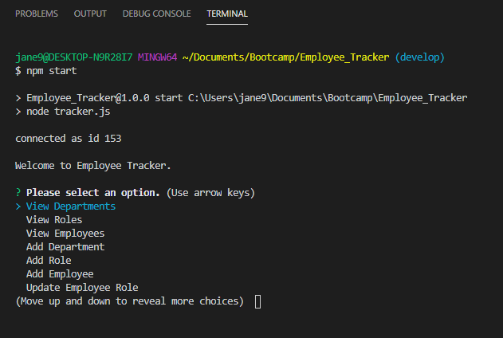

# Employee_Tracker

## Table of Contents
* [Description](#description)
* [Installation](#installation)
* [Usage](#usage)
* [Contributing](#contributing)
* [Tests](#tests)
* [License](#license)
* [Questions](#questions)

## Description <a name="description"></a>
This is a Javascript application that allows a user to input employee information into a database.  The application is run from the command line and utilizes node.js and three npm packages including mysql2, inquirer, and console.table.  The application allows the user to input data into tables for departments, roles, and employees.  The departments table includes department id and department name.  The roles table includes role id, role title, role salary, and the department in which the role belongs to.  The employees table includes employee id, employee first name, employee last name, the ID of the role in which the employee is employed, and the ID of the manager in which the employee reports to.  The intent of this application was to demonstrate the use of create, read, update, and delete (CRUD) operations on a database.  

## Installation <a name="installation"></a>
To run this application, please do the following: 

1. Clone the application's respository from GitHub onto your local drive.  The GitHub URL is: https://github.com/plainjane99/Employee_Tracker.  
2. Set up the ```npm``` package by running the following command in the root directory of the application: 
    
    ```
    npm install
    ```
    
    This will download the application's dependencies into your root directory.  You should now have a folder called ```node_modules``` and a file called ```package-lock.json```.  The ```package-lock.json``` file should include ```inquirer```, ```mysql2```, and ```console.table```.

## Usage <a name="usage"></a>
Once installation is complete, ```mysql2``` needs to be set up to create the database.  To set up the database, type in:

```
npm run sql
```

then enter in your password.  

Once ```mysql2``` is running, type in the following command to execute the database and set up the database table structure:

```
source ./db/schema.sql
```
This will create a database called company_db.  To confirm the database has been added, enter into the ```mysql2``` command line:  ```show databases```.


Seed data has been included for this application.  To add the seed data, type in the following command:

```
source ./db/seeds.sql
```
To confirm the seed data has been added, enter into the ```mysql2``` command line:  ```show tables```.

Once the database has been created and seed data has been added, if applicable, type in ```quit``` to exit ```mysql2```.

To use the application, type the following into the command line at the root directory of the application:

    npm start
    
The application will start and show a list of options to execute, as shown below:



Proceed by selecting the menu options to view, add, or revise the data in the database.

For a walk-through of this application, please view the following video:

https://drive.google.com/file/d/1RWtQJE5szsDX-mgHC9GthiU5Z_3wYtxo/view?usp=sharing

## Contributing <a name="contributing"></a>
Contributions are welcome.  Please contact me regarding improvements you would like to make.

## Tests <a name="tests"></a>
This application does not use any testing methods.

## License <a name="license"></a>
This application is covered under the MIT license.

## Questions <a name="questions"></a>
My GitHub username is ```plainjane99```.  Please feel free to peruse my other projects.

If you have any questions regarding this application, please contact me via email at jane99hsu@gmail.com.
  